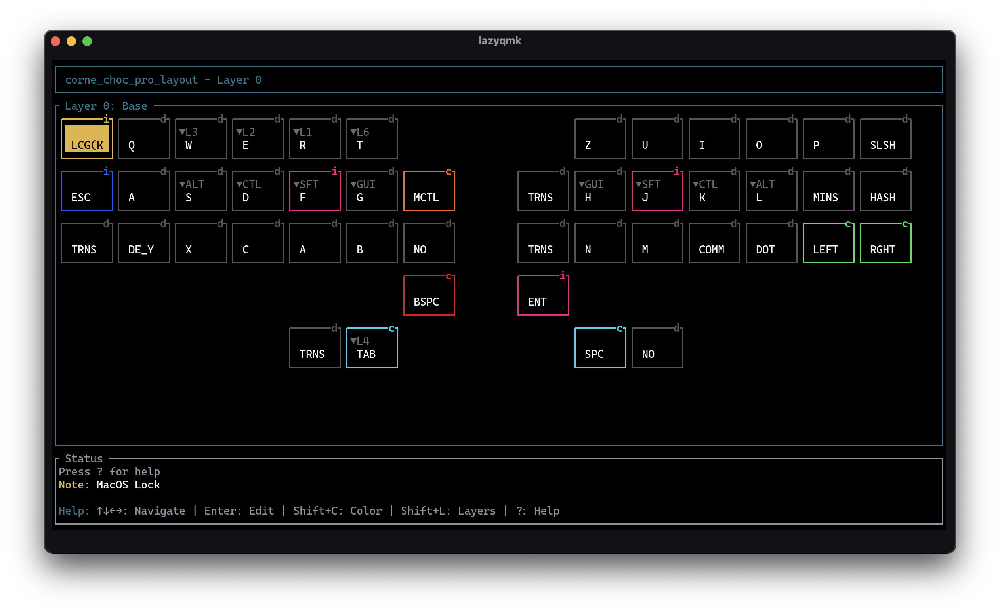
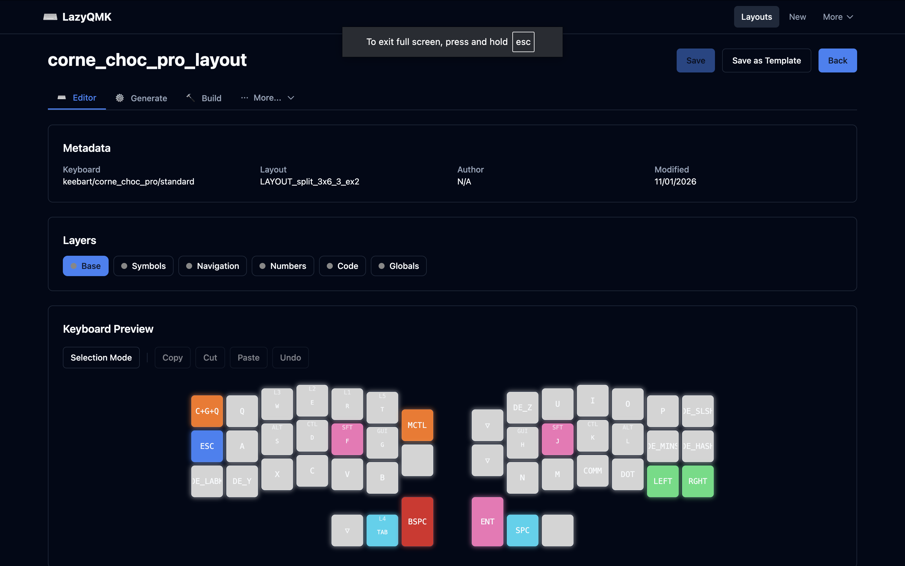

# LazyQMK
### Keyboard Layout Editor for QMK Firmware

**LazyQMK** is a keyboard layout editor for QMK firmware, available in both **terminal (TUI)** and **web-based** interfaces. Design keymaps, manage layers, organize with colors and categories, and compile firmware—whether you prefer the terminal or the browser.

---

<table>
<tr>
<td width="50%">

<p align="center"><em>Terminal UI (TUI)</em></p>
</td>
<td width="50%">

<p align="center"><em>Web Interface</em></p>
</td>
</tr>
</table>

## ✨ Two Interfaces, Same Power

**Choose Your Workflow:**
- **`lazyqmk`** - Terminal UI (TUI) for keyboard enthusiasts who live in the terminal
- **`lazyqmk web`** - Web-based editor for a modern browser experience

Both interfaces provide full feature parity: visual keyboard preview, layer management, firmware generation, and compilation.

## 💡 Motivation

I created LazyQMK because I wanted to edit my keyboard firmware for my **Keebart Corne Choc Pro** directly without diving into code every time I needed to tweak a keymap. At the same time, I wanted to support complex coloring of layers and individual keys for better visual organization.

This led me to add custom code to my QMK fork and implement visual layer-aware coloring in a terminal UI editor. Why a TUI? Because I love having small, focused utilities in the terminal—like `lazygit` and `neovim`. LazyQMK follows that philosophy: stay in the terminal, work efficiently, and keep it simple.

You can find my current layout as an example in the `examples` folder.

> [!IMPORTANT]
> **Project Status**: This is an experimental project testing how far AI-guided coding can go, so expect some rough edges! It's been mostly tested on my Corne Choc Pro, and I can't guarantee it'll work smoothly with other keyboards. The codebase may be unstable or break with other keyboards.
That said, if you're interested in helping make this more robust, broaden hardware support, or refine functionality, contributions and support from the community are highly appreciated. PRs and feedback are very welcome!. 


## 📦 Installation

> [!IMPORTANT]
> **Custom QMK Fork Required**: LazyQMK requires a custom QMK firmware fork for full functionality, especially LED/RGB lighting support. Using the official QMK firmware will result in limited features.

### Homebrew (macOS/Linux) - Recommended

```bash
brew install Radialarray/lazyqmk/lazyqmk
```

Or tap first, then install:

```bash
brew tap Radialarray/lazyqmk
brew install lazyqmk
```

### Pre-built Binary + Custom QMK Fork

> [!TIP]
> Starting with v0.13.0, `lazyqmk` includes both TUI and web interfaces in a single binary. Use `lazyqmk` for TUI or `lazyqmk web` to start the web server.

**Step 1: Download and install LazyQMK for your platform**

<details>
<summary><b>Linux (x86_64)</b></summary>

```bash
wget https://github.com/Radialarray/LazyQMK/releases/latest/download/lazyqmk-linux-x86_64.zip
unzip lazyqmk-linux-x86_64.zip
chmod +x lazyqmk
sudo mv lazyqmk /usr/local/bin/
```
</details>

<details>
<summary><b>Linux (ARM64)</b></summary>

```bash
wget https://github.com/Radialarray/LazyQMK/releases/latest/download/lazyqmk-linux-aarch64.zip
unzip lazyqmk-linux-aarch64.zip
chmod +x lazyqmk
sudo mv lazyqmk /usr/local/bin/
```
</details>

<details>
<summary><b>macOS (Apple Silicon)</b></summary>

```bash
wget https://github.com/Radialarray/LazyQMK/releases/latest/download/lazyqmk-macos-aarch64.zip
unzip lazyqmk-macos-aarch64.zip
chmod +x lazyqmk
sudo mv lazyqmk /usr/local/bin/
```

**⚠️ macOS Security Note**: The first time you run `lazyqmk`, macOS will block it because the binary isn't signed.

To allow it:
1. macOS will show a security warning when you try to run `lazyqmk`
2. Go to **System Settings → Privacy & Security**
3. Click **"Allow Anyway"** next to the LazyQMK message
4. Run `lazyqmk` again and click **"Open"** in the dialog
</details>

<details>
<summary><b>Windows (x86_64)</b></summary>

```powershell
curl -L -o lazyqmk-windows-x86_64.zip https://github.com/Radialarray/LazyQMK/releases/latest/download/lazyqmk-windows-x86_64.zip
Expand-Archive lazyqmk-windows-x86_64.zip -DestinationPath .
# Move lazyqmk.exe to a directory in your PATH (or run from current directory)
```
</details>

Or download manually from the [releases page](https://github.com/Radialarray/LazyQMK/releases/latest).

**Step 2: Clone the custom QMK firmware fork**

```bash
# Clone custom QMK firmware fork (with LED/RGB support + submodules)
git clone --recurse-submodules https://github.com/Radialarray/qmk_firmware.git ~/qmk_firmware
```

**Step 3: Launch LazyQMK and configure**

```bash
lazyqmk
```

The onboarding wizard will ask for:
- **QMK Firmware Path**: Path to the custom fork you just cloned
  - Linux: `/home/YOUR_USERNAME/qmk_firmware`
  - macOS: `/Users/YOUR_USERNAME/qmk_firmware`
  - Windows: `C:\Users\YOUR_USERNAME\qmk_firmware`
- **Keyboard**: Your keyboard name (e.g., `crkbd/rev1` for Corne)
- **Layout Variant**: Your physical layout (e.g., `LAYOUT_split_3x6_3`)

That's it! You're ready to start editing your layout.

## 🌐 Web Editor

**New in v0.13.0:** LazyQMK now includes a web-based editor with full feature parity to the TUI!

### Quick Start - Web Interface

```bash
# Install LazyQMK (see Installation section above)
# Then start the web server:
lazyqmk web

# Open your browser to http://localhost:3001
```

The `lazyqmk web` subcommand provides:
- **REST API** - Backend for layout management and firmware operations
- **Web UI** - Modern browser-based editor (embedded, no separate installation needed)
- **Single Binary** - Frontend is embedded at compile time for easy deployment

### Web Editor Features
- 📝 **Visual keyboard layout editor** - Drag-and-drop keycode assignment
- 🎨 **Layer management** - Create, delete, and organize layers with color coding
- 🔨 **Firmware generation** - Generate QMK keymap files (JSON + C code)
- 🏗️ **Firmware building** - Compile firmware and download artifacts (.uf2/.hex/.bin)
- 📊 **Real-time build logs** - Live streaming compilation output with syntax highlighting
- 📦 **Build history** - Track all firmware builds with timestamps and checksums
- 🚫 **Build cancellation** - Stop long-running compilations instantly
- 🧹 **Automatic cleanup** - Old build artifacts are cleaned up automatically (7 days, 50 max)
- 🌙 **Dark mode** - Respects system theme preferences
- ⌨️ **Keyboard shortcuts** - TUI-like shortcuts for power users
- 📱 **Responsive design** - Works on desktop, tablet, and mobile

### Configuration Options

```bash
# Custom port
lazyqmk web --port 8080

# Custom host (bind to all network interfaces for LAN/remote access)
lazyqmk web --host 0.0.0.0

# Combine options
lazyqmk web --host 0.0.0.0 --port 8080
```

### When to Use Web vs TUI

**Use the Web Editor (`lazyqmk web`) when:**
- You prefer a graphical interface with mouse interaction
- You want to share access with others on your network
- You're working on a device without terminal access
- You need to download firmware files directly from the browser

**Use the TUI (`lazyqmk`) when:**
- You live in the terminal and prefer keyboard-only workflows
- You want minimal resource usage (no web server overhead)
- You're editing layouts over SSH
- You prefer tools like `lazygit` and `neovim`

Both interfaces use the same binary and share the same configuration!

### Troubleshooting

**Web Editor Not Updating After Rebuild:**

If you've updated LazyQMK but the web interface still shows the old version, your browser may be caching the old frontend files. Force a cache refresh:

- **Chrome/Firefox/Edge:** `Ctrl+Shift+R` (Windows/Linux) or `Cmd+Shift+R` (macOS)
- **Safari:** `Cmd+Option+R` (macOS)

Alternatively, clear your browser's cache completely:
- **Chrome:** Settings → Privacy → Clear browsing data → Cached images and files
- **Firefox:** Settings → Privacy → Clear Data → Cached Web Content
- **Safari:** Safari → Clear History → All History

### Deployment

For production deployment (systemd, Docker, reverse proxy), see [`docs/WEB_DEPLOYMENT.md`](docs/WEB_DEPLOYMENT.md).

### Development

Want to contribute to the web frontend? See [`web/README.md`](web/README.md) for development setup:

```bash
cd web
npm install
npm run dev:web  # Starts backend (port 3001) + Vite dev server (port 5173) with hot-reload
```

## ✨ Features

### Core Capabilities
- **Visual Layout Editor** - See your keyboard geometry as you edit with accurate physical positioning
- **Multi-Layer Support** - Create and manage unlimited QMK layers with easy tab-based navigation
- **Smart Color System** - Four-level priority system (key → key category → layer category → layer default)
- **Category Organization** - Group keys by function (navigation, symbols, modifiers, etc.)
- **Searchable Keycode Picker** - Fuzzy search through 600+ QMK keycodes with instant filtering
- **Language-Specific Keycodes** - Support for german keycodes

### Firmware Integration
- **Direct QMK Integration** - Uses custom QMK firmware fork with LED/RGB lighting support
- **Background Compilation** - Build firmware without blocking the UI
- **Live Build Progress** - Real-time compilation output and error reporting
- **Idle Effect Screensaver** - Configurable RGB screensaver that triggers after keyboard inactivity (customizable timeout, duration, and animation effect)

### Developer-Friendly
- **Human-Readable Markdown** - Layouts stored as `.md` files with YAML frontmatter
- **Version Control Ready** - Plain text format perfect for git or a dotfile manager like [chezmoi](https://github.com/twpayne/chezmoi)
- **Template System** - Save and share common layouts across keyboards
- **Layout Export** - Export visual keyboard documentation with diagrams, color legends, and layer navigation (`Ctrl+E` or `lazyqmk export`)
- **OS Theme Integration** - Automatic dark/light mode detection from system settings

## 🚀 Quick Start

### Basic Workflow

Once configured, your typical workflow looks like this:

1. **Navigate** - Use arrow keys (`↑↓←→`) or VIM-style (`hjkl`) to move between keys
2. **Edit Key** - Press `Enter` to open the searchable keycode picker
3. **Search Keycode** - Type to fuzzy search (e.g., "ctrl" finds all Ctrl-related keys)
4. **Assign Keycode** - Press `Enter` to apply the selected keycode to the key
5. **Switch Layers** - Use `Tab` / `Shift+Tab` to navigate between layers
6. **Manage Layers** - Press `Ctrl+N` to create new layers, `Ctrl+D` to delete
7. **Organize Keys** - Press `c` to assign categories, `i` to set individual colors
8. **Save Layout** - Press `Ctrl+S` to save your changes to the Markdown file
9. **Build Firmware** - Press `Ctrl+B` to compile firmware (runs in background with live progress)

### Your First Layout

1. Launch LazyQMK: `lazyqmk`
2. You'll see your keyboard's base layer with default keycodes
3. Navigate to a key using arrow keys
4. Press `Enter` to change it
5. Type "esc" and press `Enter` to assign `KC_ESC`
6. Press `Ctrl+S` to save
7. Press `Ctrl+B` to build firmware - watch the build log in real-time!

### Creating Custom Layouts

LazyQMK stores layouts as Markdown files in your layouts directory:
- **Linux**: `~/.local/share/LazyQMK/layouts/`
- **macOS**: `~/Library/Application Support/LazyQMK/layouts/`
- **Windows**: `%APPDATA%\LazyQMK\layouts\`

You can:
- Edit layouts directly in LazyQMK (recommended)
- Edit Markdown files manually with any text editor
- Version control layouts with git
- Share layouts with others (plain text `.md` files)

## ⌨️ Keyboard Shortcuts

**Note:** Press `?` in the app for the complete, up-to-date shortcut reference.

### Essential Shortcuts
- `↑↓←→` or `hjkl` - Navigate keyboard
- `Enter` - Open keycode picker
- `Tab` / `Shift+Tab` - Switch between layers
- `Ctrl+N` - Create new layer
- `Ctrl+D` - Delete current layer
- `c` - Assign category to key
- `i` - Set individual key color
- `Ctrl+S` - Save layout
- `Ctrl+E` - Export layout to markdown documentation
- `Ctrl+Q` - Quit application
- `Ctrl+B` - Build firmware (compile)
- `Ctrl+G` - Generate firmware files only (no compile)
- `?` - Show help overlay

## 📋 File Format

Layouts are stored as **human-readable Markdown** with YAML frontmatter:

```markdown
---
name: "My Corne Layout"
keyboard: "crkbd/rev1"
layout_variant: "LAYOUT_split_3x6_3"
author: "Your Name"
version: "1.0"
created: "2025-01-15T10:30:00Z"
modified: "2025-01-15T14:20:00Z"
tags: ["colemak", "programming"]
---

## Layer 0: Base

**Color**: #282828 | **Category**: base

| KC_TAB | KC_Q | KC_W | KC_F | KC_P | KC_B |
| KC_LCTL | KC_A{#FF5555} | KC_R | KC_S | KC_T | KC_G |
| KC_LSFT | KC_Z | KC_X | KC_C | KC_D | KC_V |
| KC_ESC | MO(1) | KC_SPC |

## Layer 1: Navigation

**Color**: #FF5555 | **Category**: navigation

| KC_TRNS | KC_HOME | KC_UP | KC_END | KC_PGUP | KC_TRNS |
| KC_TRNS | KC_LEFT@navigation | KC_DOWN | KC_RGHT | KC_PGDN | KC_TRNS |
...
```

**Syntax:**
- Plain keycode: `KC_A`
- With color override: `KC_A{#FF0000}`
- With category: `KC_A@navigation`
- Combined: `KC_A{#FF0000}@navigation`

## 🎨 Color Organization

**Four-Level Priority System** (highest to lowest):

1. **Individual Key Color** (symbol: `i`) - Per-key color overrides
2. **Key Category Color** (symbol: `k`) - Color from key's assigned category
3. **Layer Category Color** (symbol: `L`) - Color from layer's assigned category
4. **Layer Default Color** (symbol: `d`) - Fallback color for layer

Each key displays its color source indicator in the top-right corner.

## 🔧 Troubleshooting

### LazyQMK won't start / Configuration wizard loops

**Issue**: LazyQMK starts but immediately shows the wizard again, or fails to save configuration.

**Solution**:
- Ensure the QMK firmware path you entered exists and contains a valid QMK installation
- Check that you have write permissions to the config directory
- Verify the custom QMK fork is properly set up (run `qmk doctor` in the QMK directory)

### Build fails / "QMK CLI not found"

**Issue**: Pressing `Ctrl+B` shows errors about missing QMK CLI or compilation fails.

**Solution**:
```bash
# Install QMK CLI if not already installed
python3 -m pip install --user qmk

# Verify QMK CLI is in PATH
qmk --version

# If not in PATH, add it (Linux/macOS):
export PATH="$HOME/.local/bin:$PATH"  # Add to ~/.bashrc or ~/.zshrc

# Verify QMK setup
cd ~/qmk_firmware  # your custom fork path
qmk doctor
```

### Keyboard not found in database

**Issue**: Your keyboard doesn't appear in the keyboard picker during setup.

**Solution**:
- Ensure you're using the custom QMK fork (Step 2)
- Update the QMK firmware (with submodules):
  ```bash
  cd ~/qmk_firmware
  git pull
  git submodule update --init --recursive
  ```
- Check if your keyboard exists in `keyboards/` directory in QMK firmware
- Try typing part of the keyboard name (fuzzy search)

### LED/RGB features not working

**Issue**: Layouts compile but LED colors don't work on the keyboard.

**Solution**:
- ⚠️ Verify you're using the **custom QMK fork**, not standard QMK
- The custom fork is at: https://github.com/Radialarray/qmk_firmware
- Standard QMK firmware does not support LED features from LazyQMK
- Check your config file points to the custom fork path

### Layout file corrupted / Parse errors

**Issue**: LazyQMK won't load your layout or shows parse errors.

**Solution**:
- Open the `.md` layout file in a text editor
- Check YAML frontmatter is properly formatted (must have `---` delimiters)
- Verify all table rows have correct number of columns (match keyboard layout)
- Look for invalid keycodes or syntax errors in key definitions
- Compare with example layout in `examples/` folder

### Permission denied errors

**Issue**: Can't save layouts or configuration.

**Solution**:
```bash
# Linux/macOS - ensure config directory exists with correct permissions
mkdir -p ~/.config/LazyQMK
chmod 755 ~/.config/LazyQMK

mkdir -p ~/.local/share/LazyQMK/layouts
chmod 755 ~/.local/share/LazyQMK/layouts
```

### Getting Help

If you encounter issues not covered here:
1. Check existing [GitHub Issues](https://github.com/Radialarray/LazyQMK/issues)
2. Open a new issue with:
   - LazyQMK version (`lazyqmk --version`)
   - Operating system and version
   - QMK firmware path and git remote info
   - Steps to reproduce the problem
   - Error messages or logs

## 🤝 Contributing

Contributions are welcome! This project is experimental and there's room for improvement:

- **Hardware Support**: Test with more keyboards, fix compatibility issues
- **Features**: New keycode categories, improved UI/UX, additional QMK features
- **Bug Fixes**: Report and fix issues you encounter
- **Documentation**: Improve guides, add examples, clarify confusing parts

Please read [ARCHITECTURE.md](docs/ARCHITECTURE.md) and [AGENTS.md](AGENTS.md) before contributing.

## 🛠️ Developer Guide

### Building from Source

If you want to build LazyQMK from source:

**Prerequisites:**
- **Rust** 1.75+ with `cargo` - [Install Rust](https://rustup.rs/)
- **Git** - For cloning repositories

**Build Steps:**

```bash
git clone --recursive https://github.com/Radialarray/LazyQMK.git
cd LazyQMK
cargo build --release
sudo ln -s $(pwd)/target/release/lazyqmk /usr/local/bin/lazyqmk
```

After building, follow the QMK fork setup and configuration steps from the Installation section above.

### Web Interface

LazyQMK includes an optional web-based UI for editing layouts in your browser.

**Quick Start:**
```bash
lazyqmk web
```
Then open http://localhost:3001 in your browser.

**Development (with hot-reload):**
```bash
cd web
npm install
npm run dev:web
```
This starts the Rust backend (port 3001) and Vite dev server (port 5173) simultaneously.

**Custom Configuration:**
```bash
# Custom port
lazyqmk web --port 8080

# Custom host (bind to all interfaces)
lazyqmk web --host 0.0.0.0
```

**Layout Storage:**
The web interface uses the same layout directory as the TUI:
- **Linux**: `~/.local/share/LazyQMK/layouts/`
- **macOS**: `~/Library/Application Support/LazyQMK/layouts/`
- **Windows**: `%APPDATA%\LazyQMK\layouts\`

**Docker (Optional):**
For containerized deployment, see [web/SETUP.md](web/SETUP.md) for Docker instructions.

## 📚 Additional Resources

- [Custom QMK Firmware Fork](https://github.com/Radialarray/qmk_firmware) - Required for LED/RGB support
- [QMK Documentation](https://docs.qmk.fm/) - Official QMK firmware docs
- [Example Layout](examples/corne_choc_pro_layout.md) - Reference Corne layout
- [Architecture Guide](docs/ARCHITECTURE.md) - Technical architecture details
- [Features Documentation](docs/FEATURES.md) - Complete feature list

## 📄 License

This project is licensed under the **MIT License** - see [LICENSE](LICENSE) for details.
